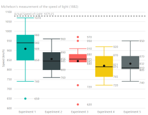
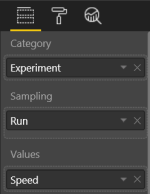
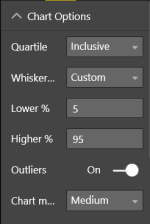
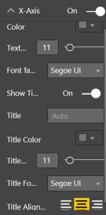
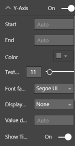
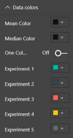
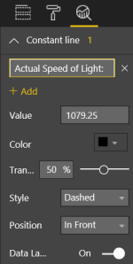
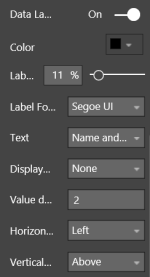

# Power BI Box and Whisker chart

## Introduction

A box and whisker chart shows basic statistical information ([five-number summary](https://en.wikipedia.org/wiki/Five-number_summary)) of a dataset: the 1st and 3rd [quartile](https://en.wikipedia.org/wiki/Quartile) (box), the [median](https://en.wikipedia.org/wiki/Median) (line), the mean (dot) and dependent of the type either the minimum and maximum value or the 1.5x [interquartile range](https://en.wikipedia.org/wiki/Interquartile_range) [IQR] (whiskers).

## Example

<iframe width="100%" height="100%" src="https://app.powerbi.com/view?r=eyJrIjoiOWJlY2VmNTAtM2EzZC00NzY3LTkyMmUtYzg1NjFmOTRkMWM0IiwidCI6IjE4NzYxNWY1LWFiYmItNDlhZC1iYjhmLTI1MzM2ZmYxZTk3ZSIsImMiOjh9" frameborder="0" onload="let f=document.getElementById('_content');this.height=f.offsetWidth/8*6;" allowFullScreen="true"></iframe>

See [here](https://app.powerbi.com/view?r=eyJrIjoiOWJlY2VmNTAtM2EzZC00NzY3LTkyMmUtYzg1NjFmOTRkMWM0IiwidCI6IjE4NzYxNWY1LWFiYmItNDlhZC1iYjhmLTI1MzM2ZmYxZTk3ZSIsImMiOjh9) for an example if the embedded version is not working.

## Data Fields

The Box and Whisker chart needs data is a specific way.

- **Category** - This field contains the categories. For each ( unique) category a different chart is drawn.
- **Sampling** - All these fields are being used to 'sample' the dataset or 'creates rows'.
- **Values** - The values field contains a numeric value to calculate the statistic values needed for the charts.

## Chart options

The box and whisker chart has chart option to influence the chart.

### Quartile calculation

In general there are two ways of calculating the quartiles of a dataset.

- **Inclusive** - When calculation the 1st and 3rd quartile, the median is included in the calculation. Equivalent of the Excel calculation `QUARTILE.INC()`
- **Exclusive** - When calculation the 1st and 3rd quartile, the median is excluded in the calculation. Equivalent of the Excel calculation `QUARTILE.EXC()`

### Whisker Type

This chart support four different types of whiskers

- **Min/Max** - The whiskers represent the minimum and maximum values of the dataset 
- **< 1.5 IQR** - The top and bottom whiskers are set to the highest/lowest value of the dataset that are included in the 1.5[IQR](https://en.wikipedia.org/wiki/Interquartile_range) range.
- **= 1.5IQR** - The top and bottom whiskers are set to 1.5[IQR](https://en.wikipedia.org/wiki/Interquartile_range) of the dataset.
- **Custom** - The whiskers can be set to a custom percentile value based on the dataset. The lower value is bound to the lower percentile possible and 25%. And the same is for the higher value, but then from 75% and up to the highest percentile value possible.

### Outliers

Option to enable is outliers should be visible, when available. This option is not available when the whisker type is set to *Min/Max*

### Chart Margin

Option to set the margin between the different charts. Is ignored when data labels are enabled.

## X-Axis

There are several options to change the default X-axis

- **On/Off** - Enable the X-Axis
- **Color** - Color used for the axis labels
- **Text size** - Text size used for the axis labels
- **Fort family** - Dropdown that contains different fonts that is being used for the axis labels
- **Show title** - Option to show or hide a axis title
- **Title** - The text being show as title. If none is provided the name of the *Values* is being used.
- **Title Color** - Color of the title
- **Title Text Size** - Text size of the title
- **Title Font Family** - Dropdown that contains different fonts that is being used for the title
- **Title Alignment** - Alignment of the title related to the axis.

## Y-Axis

There are several options to change the default Y-axis

- **On/Off** - Enable the Y-Axis
- **Start** - A custom start value for the axis. Cannot be higher that the automatic calculated minimum.
- **End** - A custom end value for the axis. Cannot be lower that the automatic calculated maximum.
- **Color** - Color used for the axis labels
- **Text size** - Text size used for the axis labels
- **Font family** - Dropdown that contains different fonts that is being used for the axis labels
- **Display Units** - Option to change the unit shown after the axis labels
- **Value Decimals** - Option to alter the amount of decimals used by the axis labels
- **Show title** - Option to show or hide a axis title
- **Title** - The text being show as title. If none is provided the name of the *Values* is being used.
- **Title Color** - Color of the title
- **Title Text Size** - Text size of the title
- **Title Font Family** - Dropdown that contains different fonts that is being used for the title
- **Title Alignment** - Alignment of the title related to the axis. Here left is at the start of the axis and right is the end.

## Data Color

The chart can be altered by using different colors for different elements.

- **Mean Color** - The color used by the mean dot for every chart
- **Median Color** - The color used by the median line for every chart
- **One Color** - Option to change the category coloring and enables a one color for every category. If enabled, the first category color is used for all categories and can be changed.
- **Categories Color** - Per category a different color is being used based of the default values of the theme. Each individual color can be changed.

## Data Labels

Option to alter he default data labels.

- **On/Off** - Enable data labels
- **Color** - Color used for the data labels
- **Text size** - Text size used for the data labels
- **Font family** - Dropdown that contains different fonts that is being used for the data labels
- **Display Units** - Option to change the unit shown after the data labels
- **Value Decimals** - Option to alter the amount of decimals used by the data labels

## Shapes

Option to show or hide the mean dot and median line.

## Gridlines

There are different option to change the gridlines.

- **On/Off** - Enable (major) gridlines
- **Thickness** - Line thickness of the major gridlines
- **Color** - Color of the major gridlines
- **Minor gridlines** - Enable minor gridlines
- **Thickness** - Line thickness of the minor gridlines
- **Color** - Color of the minor gridlines

## Reference lines

With this version it is possible to add different reference lines to the chart.

- **Name** - Name of the reference line
- **Add** - Add additional reference lines
- **Value** - The value of the reference line
- **Color** - Color of the reference line
- **Transparency** - Set the transparency of the reference line
- **Style** - Three different style are available for reference lines: Dashed, dotted and solid
- **Position** - Option to show the reference line In front of the charts of behind
- **Data Label** - Enable a data label of the reference line

### Reference line label

- **Color** - Color of the label
- **Label Text Size** - Text size used for the label 
- **Label Font Family** - Dropdown that contains different fonts that is being used for the label
- **Text** - Either choose to display the *value*, *name* or both as label
- **Display Units** - Option to change the unit shown after the label
- **Value Decimals** - Option to alter the amount of decimals used by the label
- **Horizontal Position** - Choose the horizontal position (Left or Right) related to the reference line
- **Vertical Position** - Choose the vertical position (Above or Under) related to the reference line

## Changelog

See for the list of changes [here](xref:pbi/boxandwhisker/changelog).

## Feedback

### [**Documentation**](#tab/docs)

Documentation feedback

### [**Product**](#tab/product)

Product feedback

***

### [**Open**](#tab/docs-open/docs)

### [**Closed**](#tab/docs-closed/docs)

### [**Open**](#tab/product-open/product)

### [**Closed**](#tab/product-closed/product)

***