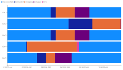
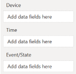
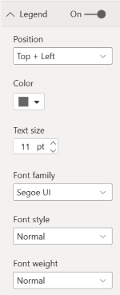
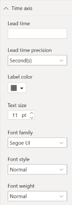
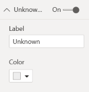

# Power BI Event Viewer

## Event Viewer

The Event Viewer chart visualizes device events over time. Ideal for IoT devices that report new states  

## Example

<iframe width="100%" height="400" src="https://app.powerbi.com/view?r=eyJrIjoiNjdiYzdjNDUtNzQzOC00MzZlLTg2ZTMtMzk3NDJlYjEzMjY1IiwidCI6IjE4NzYxNWY1LWFiYmItNDlhZC1iYjhmLTI1MzM2ZmYxZTk3ZSIsImMiOjh9" frameborder="0" onload="this.height=document.getElementById('_content').offsetWidth/8*6;" allowFullScreen="true"></iframe>

See [here](https://app.powerbi.com/view?r=eyJrIjoiNjdiYzdjNDUtNzQzOC00MzZlLTg2ZTMtMzk3NDJlYjEzMjY1IiwidCI6IjE4NzYxNWY1LWFiYmItNDlhZC1iYjhmLTI1MzM2ZmYxZTk3ZSIsImMiOjh9) for an example if the embedded version is not working.

## Data Fields

The Event Viewer chart needs data it a specific way.

- **Devices** - Field that contain the different devices that have state changes.
- **Time** - Time values used for the time axis.
- **Event/State** - The state value/string reported by the device(s). This field will be aggregated using the 'First' aggregation.

> [!IMPORTANT]
> The visual aggregates events per device and timestamp; by sure that the datasets contains a maximum of **one** event per timestamp per device. E.g. if there are multiple events per second, the visual will only visualize one event and the rest of the events is ignored.

## Legend

With the legend option the behavior of the legend can be changed

- **On** - Turn the legend on or off
- **Position** - Alter the position of the legend: either *top*, of *bottom* in combination with *left*, *right*, and *center*
- **Font Color** - Font color used for the legend
- **Text size** - Text size used for the legend
- **Font Family** - Font Family used by the legend
- **Font Style** - Font Family used by the legend. Options are: Normal and *Italic*
- **Font Weight** - Font Weight used by the legend. Options are: 
Light
, Normal, 
Semi Bold
 and **Bold**

## Device axis

With the device axis option the behavior of the device (vertical) axis can be changed

- **Label Color** - Font color used for the labels
- **Text size** - Text size used for the labels
- **Font Family** - Font Family used by the labels
- **Font Style** - Font Family used by the labels. Options are: Normal and *Italic*
- **Font Weight** - Font Weight used by the labels. Options are: 
Light
, Normal, 
Semi Bold
 and **Bold**

## Time axis

With the time axis option the behavior of the time (horzontal) axis can be changed

- **Lead time** - Amount of time in used to 'ignore' before start the axis 
- **Lead time precision** - Precicion used for the lead time: *seconds*, *minutes*, or *hours*
- **Label Color** - Font color used for the labels
- **Text size** - Text size used for the labels
- **Font Family** - Font Family used by the labels
- **Font Style** - Font Family used by the labels. Options are: Normal and *Italic*
- **Font Weight** - Font Weight used by the labels. Options are: 
Light
, Normal, 
Semi Bold
 and **Bold**

## State color

With the state color option it is possible to alter the colors of the different states. States are populated based on the data provided to the visual

- **Persist formatting** - Toggle to store current state color config. Toggle will be disabled after storing the color config.
- **Colors** - JSON Array with prefix link colors: [{name, color}]: use to set the different state colors to the provided one.

## Unknown

With the unknown formatting option it is possible to alter the 'unknown' state. The unknown state can be used is the first event of a device is arriving late compared to the start time of the axis. 

- **On** - Turn the unnown state on or off
- **Label** - The text being used as the 'unknwon' state. Default: `unknown`

## Changelog

See for the list of changes [here](xref:pbi/eventviewer/changelog).

## Feedback

### [**Documentation**](#tab/docs)

If you have any comment related to the documentation, like corrections, unclear features or missing documentation, feel free to leave feedback below via GitHub. Or correct it yourself and submit a PR; see [CONTRIBUTING.md](https://github.com/liprec/azurebi-docs/blob/master/.github/CONTRIBUTING.md) for more details.
*GitHub account required.*

### [**Product**](#tab/product)

If you have any comment related to the working of the described product, feel free to leave feedback below via GitHub.
*GitHub account required.*

***

### [**Open**](#tab/docs-open/docs)

### [**Closed**](#tab/docs-closed/docs)

### [**Open**](#tab/product-open/product)

### [**Closed**](#tab/product-closed/product)

***
