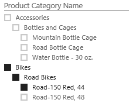
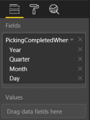
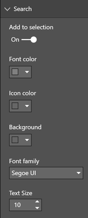
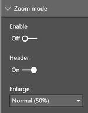

# Power BI HierarchySlicer

## Hierarchyslicer

The HierarchySlicer for Power BI provides the opportunity to simple select multiple members of different levels of a hierarchy as selection. The slicer can be used with an existing hierarchy or a manual created hierarchy.

## Example

<iframe width="100%" height="400" src="https://app.powerbi.com/view?r=eyJrIjoiYjYxYTAzMTgtOWI4OS00ZTA2LTk1MDYtZGUwZGUyNzE1OTgxIiwidCI6IjE4NzYxNWY1LWFiYmItNDlhZC1iYjhmLTI1MzM2ZmYxZTk3ZSIsImMiOjh9" frameborder="0" onload="this.height=document.getElementById('_content').offsetWidth/8*6;" allowFullScreen="true"></iframe>

See [here](https://app.powerbi.com/view?r=eyJrIjoiYjYxYTAzMTgtOWI4OS00ZTA2LTk1MDYtZGUwZGUyNzE1OTgxIiwidCI6IjE4NzYxNWY1LWFiYmItNDlhZC1iYjhmLTI1MzM2ZmYxZTk3ZSIsImMiOjh9) for an example if the embedded version is not working.

## Data Fields

The HierarchySlicer needs data it a specific way.

- **Fields** - These fields are the base of the hierarchy. Each field will represent a level in the hierarchy
- **Values** - With a value it is possible to (pre)filter the hierarchy to show only members that have a value. Typical scenario: filter a product/category hierarchy with sales. The values are *not* shown in the visual

## Selection

With the selection option the behavior of the hierarchy can be changed

- **Single Select** - When set to true (default) only one member of the hierarchy can be selected. When set to false a multiple selection is possible. *Note: Ctrl select is not working.*
- **Hide Members** - Control if items should be hidden to support 'ragged hierarchies'
    - *Never* - Never hide members
    - *Empty* - Hide items if the value is 'empty'. See *'' strings are empty* option for additional options
    - *Parent Name* - Hide items if the value is the same as the parent value 
- **'' strings are empty** - When set to *On* both empty strings ('') and 'null' strings are treaded the same.
- **Select All** - When enabled there is a 'Select All' member the select (or deselect) all the available members.
- **Select All Label** - If the 'Select All' option is enabled this option can be used to alter the label of this member.

## Header

Basic formatting of the header is possible in this section.

- **On/Off** - Enable the header
- **Title** - Enter a custom header. If left empty the name of the first data field is used as title
- **Show summary** - Add selection summary to the title
- **Font Color** - Font color used for the header
- **Background** - Background color for the header
- **Outline** - Option to set the outline around the title: None, Bottom Only, Top Only, Left Only, Right Only, Top + Bottom, Left + Right and Frame
- **Text size** - Text size used for the header
- **Font Family** - Font Family used by the title
- **Font Style** - Font Family used by the title. Options are: Normal and *Italic*
- **Font Weight** - Font Weight used by the title. Options are: 
Light
, Normal, 
Semi Bold
 and **Bold**

## Items

Basic color formatting of the items

- **Font Color** - Font color used for the items
- **Hover** - Color use as font color is the items if 'hovered' by the mousepointer.
- **Select Color** - Font color of the selected items
- **Background** - Background color for the items
- **Text size** - Text size used for the items
- **Font Family** - Font Family used by the items
- **Font Style** - Font Family used by the items. Options are: Normal and *Italic*
- **Font Weight** - Font Weight used by the items. Options are: 
Light
, Normal, 
Semi Bold
 and **Bold**

## Search box

If Search is enables via the visual menu (...) this option will be available to format the search experiance.

- **Add to selection** - Enables the option to add the selection made via the search result to be added to the current selection. *Only with multi-select enables*
- **Font Color** - Font color used for the text of the searchbox
- **Icon Color** - Color used for the icons in the searchbox
- **Background** - Color used for the background color of the searchbox
- **Font Family** - Font Family used by the text of the searchbox
- **Text size** - Text size used for the text of the searchbox

## Zoom mode

Configuration of the 'zoom mode' that can be enabled by double clicking on the slicer title

- **Enable** - Option to enable zoom mode directly
- **Header** - Option to enable zoom mode via double tap/click on the title
- **Enlarge** - Define how many the slicer needs to be enlarges: 25%, 50% or 100%.

## Limitations

The current version (v2.0) has the following limitations

- Visualize the slicer as a dropdown will not happen as the API doesn't support this

## Changelog

See for the list of changes [here](xref:pbi/hierarchyslicer/changelog).

## Feedback

### [**Documentation**](#tab/docs)

If you have any comment related to the documentation, like corrections, unclear features or missing documentation, feel free to leave feedback below via GitHub. Or correct it yourself and submit a PR; see [CONTRIBUTING.md](https://github.com/liprec/azurebi-docs/blob/master/.github/CONTRIBUTING.md) for more details.
*GitHub account required.*

### [**Product**](#tab/product)

If you have any comment related to the working of the described product, feel free to leave feedback below via GitHub.
*GitHub account required.*

***

### [**Open**](#tab/docs-open/docs)

### [**Closed**](#tab/docs-closed/docs)

### [**Open**](#tab/product-open/product)

### [**Closed**](#tab/product-closed/product)

***
