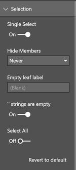

# Power BI Hierarchy Slicer

## Hierarchy slicer

The hierarchy slicer for Power BI provides the opportunity to simple select multiple members of different levels of a hierarchy as selection. The slicer can be used with an existing hierarchy or a manual created hierarchy.

## Example

<iframe width="100%" height="400" src="https://app.powerbi.com/view?r=eyJrIjoiYjYxYTAzMTgtOWI4OS00ZTA2LTk1MDYtZGUwZGUyNzE1OTgxIiwidCI6IjE4NzYxNWY1LWFiYmItNDlhZC1iYjhmLTI1MzM2ZmYxZTk3ZSIsImMiOjh9" frameborder="0" onload="let f=document.getElementById('_content');this.height=f.offsetWidth/8*6;" allowFullScreen="true"></iframe>

See [here](https://app.powerbi.com/view?r=eyJrIjoiYjYxYTAzMTgtOWI4OS00ZTA2LTk1MDYtZGUwZGUyNzE1OTgxIiwidCI6IjE4NzYxNWY1LWFiYmItNDlhZC1iYjhmLTI1MzM2ZmYxZTk3ZSIsImMiOjh9) for an example if the embedded version is not working.

## Data Fields

The HierarchySlicer needs data it a specific way.

- **Fields** - These fields are the base of the hierarchy. Each field will represent a level in the hierarchy
- **Values** - With a value it is possible to (pre)filter the hierarchy to show only members that have a value. Typical scenario: filter a product/category hierarchy with sales. The values are *not* shown in the visual

## Selection

With the selection option the behavior of the hierarchy can be changed

- **Single Select** - When set to true (default) only one member of the hierarchy can be selected. When set to false a multiple selection is possible. Note: Ctrl select is not working. 
- **Empty levels** - When set to true enables the hierarchy to support ragged version. If a level is 'empty' than the lower levels are ignored.
- **Select All** - When enabled there is a 'Select All' member the select (or deselect) all the available members.
- **Select All Label** - If the 'Select All' option is enabled this option can be used to alter the label of this member.

## Header

Basic formatting of the header is possible in this section.

- **On/Off** - Enable the header
- **Title** - Enter a custom header
- **Font Color** - Font color used for the header
- **Background** - Background color for the header
- **Text size** - Text size used for the header

## Items

Basic color formatting of the items

- **Font Color** - Font color used for the items
- **Select Color** - Font color of the selected items
- **Background** - Background color for the items
- **Text size** - Text size used for the header

## Limitations

The current version (v1.5.5) has the following limitations

- Bookmarks are not supported. Will be addressed in the next release
- Maximum number of hierarcht items is 4,000. Will be addressed in the next release
- Persistent Slicers are not supported.
- Sync Slicers are not yet supported: the custom visuals API is preventing this.
- Export to PowerPoint/Emails is not possible as the slicer is not certified and cannot be certified
- Visualize the slicer as a dropdown will not happen as the API doesn't support this

## Changelog

See for the list of changes [here](xref:pbi/hierarchyslicer/changelog).

## Feedback

### [**Documentation**](#tab/docs)

If you have any comment related to the documentation, like corrections, unclear features or missing documentation, feel free to leave feedback below via GitHub. Or correct it yourself and submit a PR; see [CONTRIBUTING.md](https://github.com/liprec/azurebi-docs/blob/master/.github/CONTRIBUTING.md) for more details.
*GitHub account required.*

### [**Product**](#tab/product)

If you have any comment related to the working of the described product, feel free to leave feedback below via GitHub.
*GitHub account required.*

***

### [**Open**](#tab/docs-open/docs)

### [**Closed**](#tab/docs-closed/docs)

### [**Open**](#tab/product-open/product)

### [**Closed**](#tab/product-closed/product)

***
